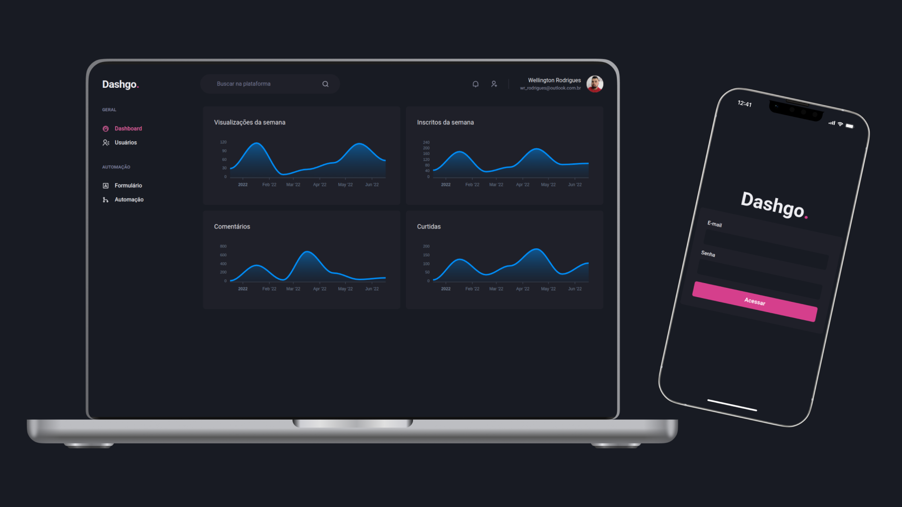

<h1 align="center">
  
</h1>

<h1 align="center">
  
</h1>

# Sobre o projeto

<p>
  Dashgo trata-se de um dashboard fictício, principal objetivo desse projeto é para aprender a usar gráficos dentro do NextJs e para performance usando uma ferramenta chamada React Query.
</p>

# Tecnologias

- [NextJs](https://nextjs.org/)
- [TypeScript](https://www.typescriptlang.org/)
- [Yup](https://www.npmjs.com/package/yup)
- [React Hook Form](https://react-hook-form.com/)
- [React Query](https://react-query-v3.tanstack.com/)
- [Chackra UI](https://chakra-ui.com/)
- [MirageJs](https://miragejs.com/)
- [ApexCharts](https://apexcharts.com/)

## Como baixar o projeto

```bash
# Clonar o repositório
$ git clone https://github.com/wellingtonrodriguesbr/dashgo.git

# Entrar no diretório
$ cd dashgo

# Instalar as dependências
$ yarn install

# Rodar o projeto
$ yarn dev
```

<br/>
<hr/>

<p align="center">Desenvolvido por <a href="https://www.linkedin.com/in/wellingtonrodriguesbr/" target="_blank">Wellington Rodrigues</a> ✌🏽</p>
